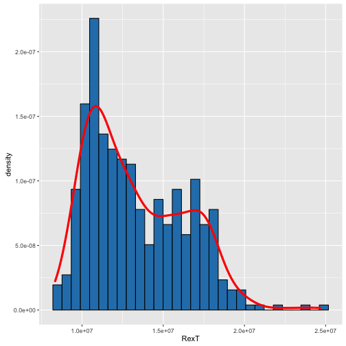
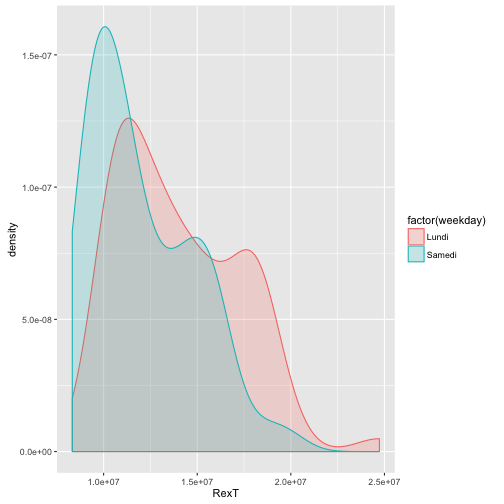

### Motivation

In Excel and in Tableau, drawing histograms is really a pain. In the opposite, it is very simple in R. Let's see how to do it step by step.

### R Code

#### Setup

First, we have to setup the environment and import the right libraries

```r
library("dplyr")
library("ggplot2")
library("lubridate")
```

Second, let's import some data to plot.

```r
raw_data <- read.csv(file = "mock_dataset.csv", header = TRUE, sep = ";")
raw_data$day <- as.Date(raw_data$day, format = '%Y-%m-%d')
data <- raw_data %>%
     dplyr::mutate(RexT = revenue - tac, weekday = weekdays(day)) %>%
     dplyr::select(day, weekday, RexT) %>%
     dplyr::filter(day > '2014-01-01')
```

#### Simple Histograms

The simplest histgram

```r
h1 <- ggplot(data = data)+
     geom_histogram(aes(x = RexT), color = "black", fill = "#2980b9")
plot(h1)
```


You can fill the bar according to the value of a variable

```r
h2 <- ggplot(data = data)+
     geom_histogram(aes(x = RexT, fill = ..count..), color = "white")
plot(h2)
```


You can show the density rather than the count of elements

```r
h3 <- ggplot(data = data, aes(x = RexT, y = ..density..)) +
     geom_histogram(color = "black", fill = "#2980b9") +
     geom_line(colour = 26, stat = 'density', size = 1.5)
plot(h3)
```



#### Other histograms

You can choose the width...

```r
h4 <- ggplot(data = data, aes(x = RexT)) +
     geom_histogram(color = "black", fill = "#2980b9", binwidth = 2e5)
plot(h4)
```


... or the number of the bins

```r
nbr_bins <- 10
h5 <- ggplot(data = data, aes(x = RexT)) +
     geom_histogram(color = "black", fill = "#2980b9", binwidth = (max(data$RexT)-min(data$RexT))/(nbr_bins-1))
plot(h5)
```


You could decide that you want to split the days of the week using different colors. We will the use the variable "weekday" that was created in the very beginning of this script.

Doing so, you can decide to stack the bars:

```r
h6 <- ggplot(data = data, aes(x = RexT, fill = weekday)) +
     geom_histogram(binwidth = 1000000, color = "white")
plot(h6)
```


Or we could put the bars side by side. For viewability reasons, we keep only 2 week days here (Monday and Saturday).

```r
data_2 <- raw_data %>%
     dplyr::mutate(RexT = revenue - tac, weekday = weekdays(day)) %>%
     dplyr::select(day, weekday, RexT) %>%
     dplyr::filter(day > '2014-01-01' & weekday %in% c('Lundi', 'Samedi'))

nbr_bins <- 30
h7 <- ggplot(data = data_2, aes(x = RexT, fill = factor(weekday))) +
     geom_histogram(position = "dodge",  colour = "black", binwidth = (max(data_2$RexT)-min(data_2$RexT))/(nbr_bins-1))
plot(h7)
```


#### Let's combine several options

```r
h8 <- ggplot(data = data_2, aes(x = RexT, y = ..density..)) +
     geom_histogram(aes(fill = factor(weekday)), alpha = 0.5, position = "dodge", binwidth = (max(data_2$RexT)-min(data_2$RexT))/(nbr_bins-1)) +
     geom_line(aes(colour = factor(weekday)), stat = 'density' , size = 1.5)
plot(h8)
```


In the case where we only would like to see the density.

```r
h9 <- ggplot(data = data_2, aes(x = RexT, y = ..density..)) +
     geom_density(aes(colour = factor(weekday), fill = factor(weekday)), alpha = 0.2)
plot(h9)
```




#### Customized bins

We use a logaritmic scale for the x-axis:

```r
nbr_bins <- 10

h10 <- ggplot(data = data, aes(x = RexT)) +
     geom_histogram(color = "black", fill = "#2980b9")+
     scale_x_log10()
plot(h10)
```


*Warning: the bins have constant width in the NEW scale*

If you want the bins to have a constant width in the original scale, you should use:

```r
h11 <- ggplot(data = data, aes(x = RexT)) +
     geom_histogram(color = "black", fill = "#2980b9")+
     coord_trans(x = "log10")
plot(h11)
```


### Conclusion

There are of course many many more more options to personalize your histogram at wish. Please, go check [ggplot2 website](http://docs.ggplot2.org/0.9.3.1/geom_histogram.html#)
