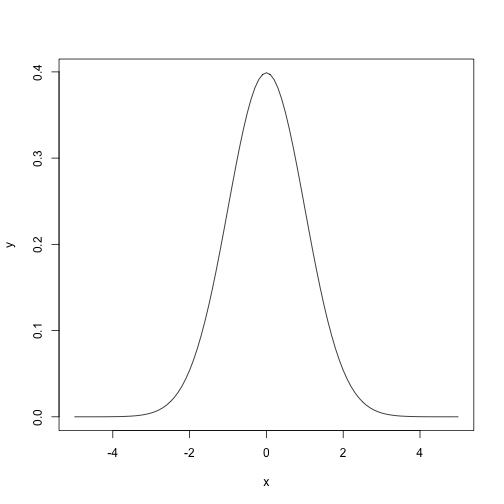

### Motivation

This is a test

### R code

Here is some R example code.


```r
x <- seq(-5, 5, 0.1)
y <- dnorm(x, mean = 0, sd = 1)

plot(x, y, type = 'l')
```



### Query

```sql
     SELECT
          *
     FROM
          db.my_table
     WHERE
          my_field = 'test'
```

### Conclusion
